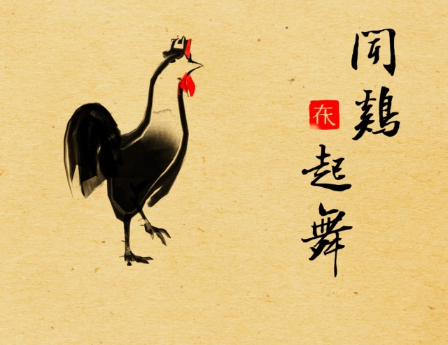
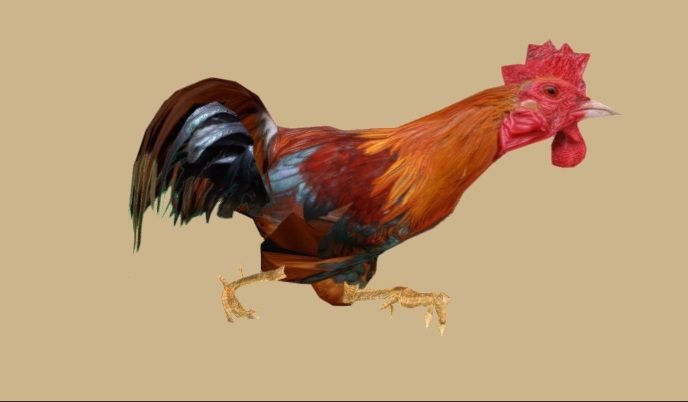
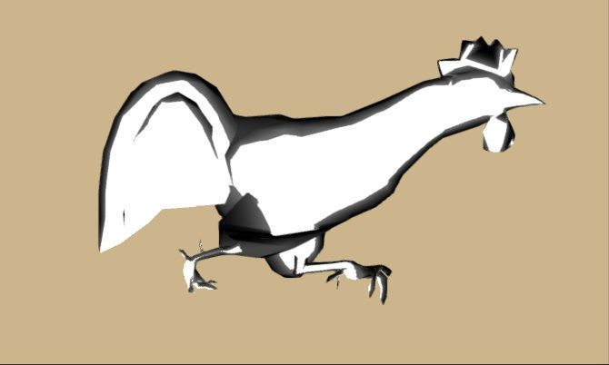
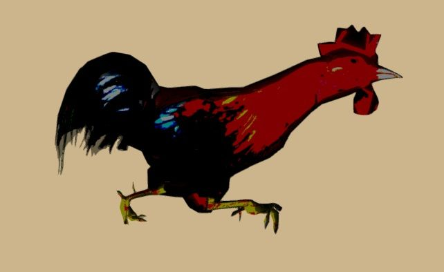
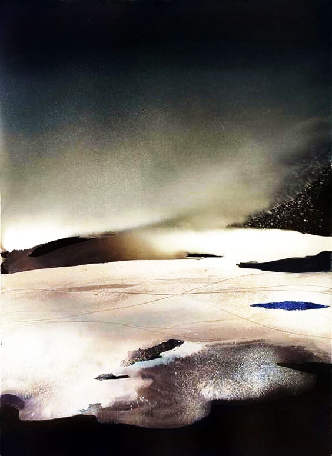
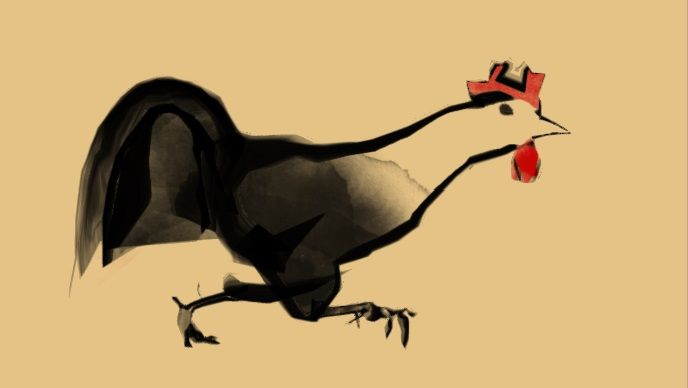
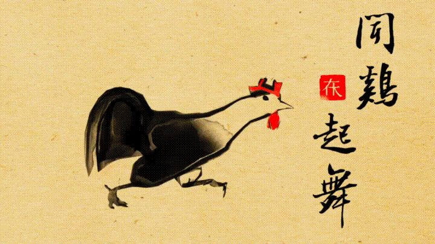

# Chinese Painting Visual Effect Demo

This is a demo for Chinese Painting Visual Effect in Unity.

## Modeling

The original model looks like this(3d model + texture)

## Edge Detection

## Color Scale

## Mask

Image for masking

Effect after adding mask

## Finalization

Post Effect + Details

# 水墨风渲染

这是一个在Unity里实现水墨风渲染的Demo

教程参见：
https://zhuanlan.zhihu.com/p/25346977